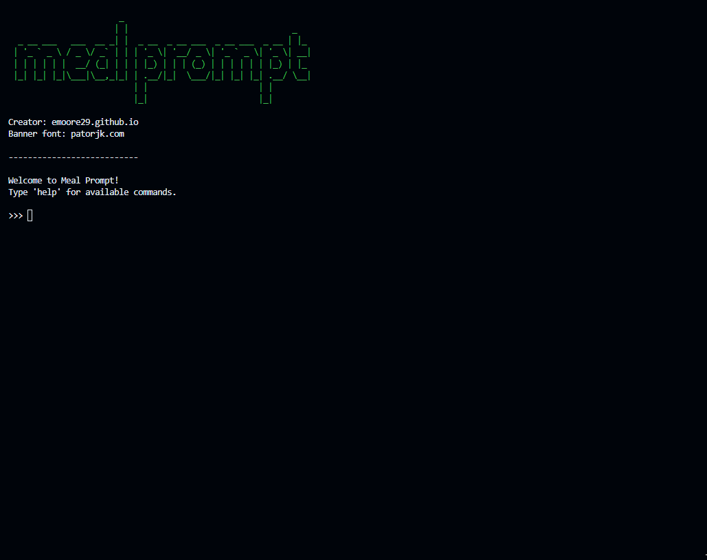

# Meal Prompt

Meal Prompt is an interactive shell written in Python. It allows users to request a 'meal prompt', which is a list of ingredients semi-randomly selected from a TinyDB. Users can also view and update the database via the CLI.



## About

The purpose of Meal Prompt is to help users eat seasonally and come up with meal ideas. Meal prompts will typically include suggestions of at least one seasonal fruit and/or vegetable alongside a source of carbohydrates, protein, and fat. The prompts are not meant to be a perfect meal. Which ingredients to use, which to ignore, and how to combine them is all for the user to come up with!

However, to ensure ingredients are somewhat compatible, ingredients are selected based on their sweet and savoury characteristics. Complimentary ingredients will be used in future updates to improve the compatibility of ingredient suggestions.

## Database structure

Meal Prompt uses TinyDB to manage the ingredients. Each ingredient has the following features:

- Name: string (any)
- Type: list of valid types ('fruit', 'vegetable', 'carb', 'fat', 'protein')
- Taste: list of valid tastes ('sweet', 'savoury')
- Favourite: string ('y' or 'n')
- Compliments: list of strings (any)
- Season: list of two integers representing the month range the item is in season (empty for non-seasonal items)

Ingredient names are not validated - it is up to the user to input real ingredients. This gives the user flexibility to add non-conventional ingredient names. As such, complimentary ingredient names are also not validated.

Validation does occur for names in the sense that an ingredient can only have one name.

## Prompt Generation Algorithm

1. A random type is selected from the list of valid types
2. A random ingredient of that type is selected from the database (if the type is fruit/vegetable, the ingredient must be seasonal)
3. If the ingredient has not already been added, it is added to a list tracking added ingredients
4. The type is removed from the list of types to search for
5. The ingredient is printed to the console
6. Repeat steps 1-5 until there are no more types left to search for

This ensures no repeat ingredients are given in the meal prompt, and minimises type repetition (some duplicate types are unavoidable because ingredients can have multiple types).

Note: There is a small weight in favour of selecting favourited ingredients.

Weighting complimentary ingredients will be added in the future.

## Commands

- help -- shows command documentation
- add -- add an item
- edit -- edit an item
- pmt -- generate a meal prompt
- quit -- quit the program
- rm -- remove an item
- show -- show an item or items

Command documentation can be viewed in further detail when running the program or in the code itself.

## Unit testing

Unit testing is currently being written.

## Installation Instructions

```
# Open a terminal (Command Prompt or PowerShell for Windows, Terminal for macOS or Linux)

# Ensure Git is installed
# Visit https://git-scm.com to download and install console Git if not already installed

# Clone the repository
git clone https://github.com/emoore29/meal-prompt.git

# Navigate to the project directory
cd meal-prompt

# Install dependencies
pip install -r requirements.txt

# Run the program
py meal_prompt.py
```

## Requirements

- Python 3.12.2 or higher
- Dependencies: Listed in requirements.txt
